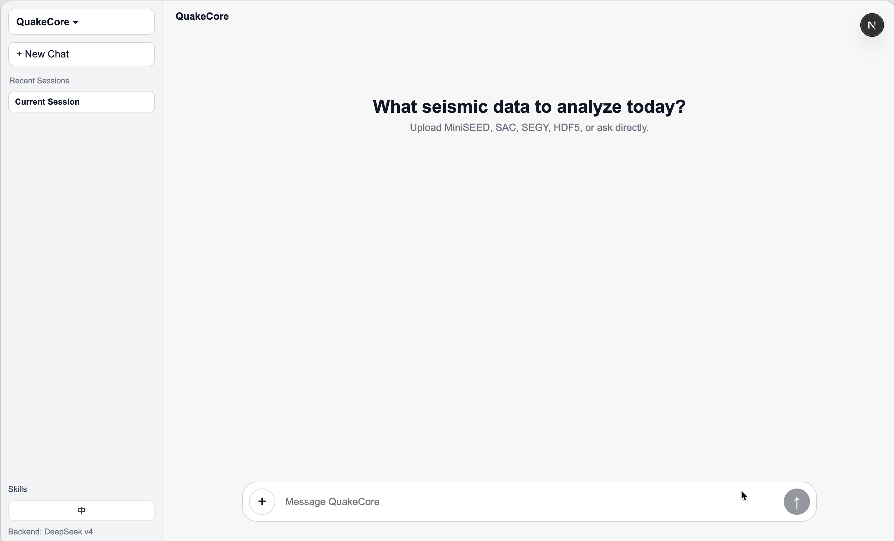
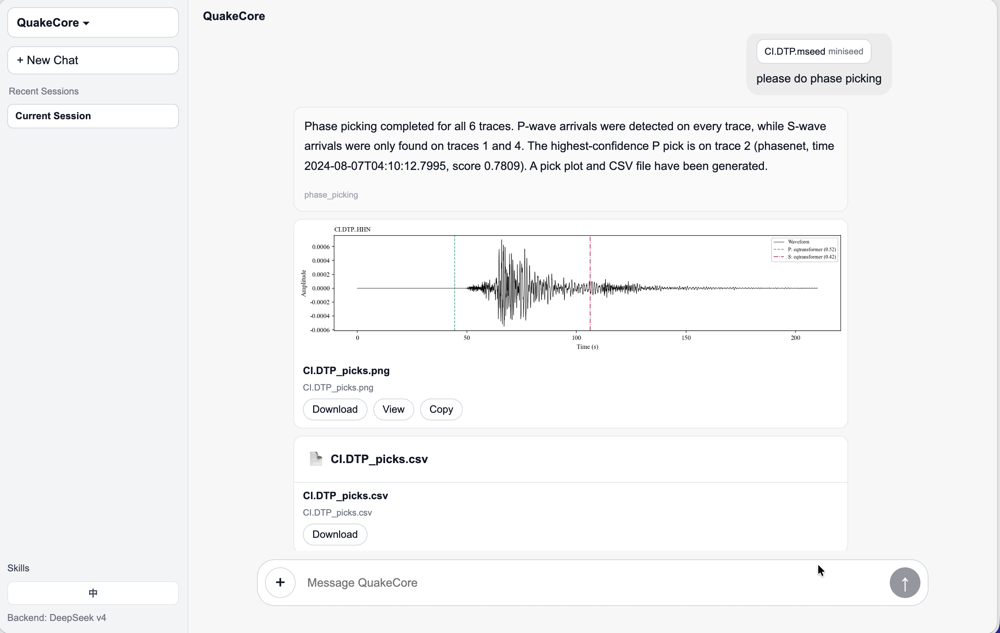

# QuakeCore AI Agent

QuakeCore is an AI-based seismic data processing agent framework. It allows users to upload various seismic data formats (MiniSEED, SAC, SEG-Y, HDF5) and interact with an AI via natural language to analyze file structures, get statistics, and perform phase picking.



## Features
- **Multi-Format Support**: Reads SEGY, MiniSEED, SAC, HDF5, NumPy arrays.
- **Smart Phase Picking**: Built-in STA/LTA, AIC, and other traditional picking algorithms.
- **API Backend**: FastAPI routes for chat, uploads, config, skills, and artifacts.
- **Frontend**: A ChatGPT-like Next.js chat UI with integrated click upload, drag-and-drop upload, and paste upload.
- **Local/Cloud AI Support**: Integrates with local Ollama or cloud-based DeepSeek APIs.

## Quick Start

### 1. Prerequisites

- **Conda** — for managing the Python environment ([Miniforge](https://github.com/conda-forge/miniforge) recommended, or [Miniconda](https://docs.anaconda.com/miniconda/) / [Anaconda](https://www.anaconda.com/download))
- **Node.js & npm** — for running the frontend ([Download](https://nodejs.org/))

### 2. Installation

```bash
git clone https://github.com/Chuan1937/QuakeCore.git
cd QuakeCore

# Create and activate a conda environment
conda create -n quakecore python=3.12 -y
conda activate quakecore

# Install dependencies
pip install -r requirements.txt

# Install backend API dependencies
pip install -r requirements-backend.txt
```

### 2. Configure LLM

QuakeCore supports two providers:

- **DeepSeek API**
- **Ollama**

Recommended DeepSeek setup:

```bash
export DEEPSEEK_API_KEY=your_key
```

Recommended defaults:

- Provider: `deepseek`
- Model: `deepseek-v4-flash`
- Base URL: `https://api.deepseek.com`

Ollama example:

```bash
ollama pull qwen2.5:3b
```

Default Ollama base URL:

- `http://localhost:11434`

### 3. Start the Backend API

```bash
conda activate quakecore
uvicorn backend.main:app --host 127.0.0.1 --port 8000 --reload
```

Backend URLs:

- API: `http://127.0.0.1:8000`
- OpenAPI docs: `http://127.0.0.1:8000/docs`

### 4. Start the Frontend

```bash
cd frontend
npm install
npm run dev
```

Open:

- Frontend: `http://localhost:3000`

If the frontend should talk to a non-default backend, set:

```bash
export NEXT_PUBLIC_API_BASE_URL=http://127.0.0.1:8000
```

By default, the frontend uses `http://127.0.0.1:8000`.

## Configuration

### Frontend Settings Page

After starting backend and frontend, open the settings page in the web UI and save model settings there.

- DeepSeek:
  - Provider: `deepseek`
  - Model: `deepseek-v4-flash`
  - API Key: can be left empty if `DEEPSEEK_API_KEY` is already exported
  - Base URL: `https://api.deepseek.com`
- Ollama:
  - Provider: `ollama`
  - Base URL: usually `http://localhost:11434`
  - Model: detected from the local Ollama server


## Usage
1. Configure your LLM settings in the sidebar.
2. Upload a seismic data file (or use the examples in `example_data/`).
3. Chat with the AI! Try prompts like:
   - *"Analyze this SEGY file's structure."*
   - *"What is the sampling rate of this file?"*
   - *"Perform phase picking on the loaded waveform."*
   - *"Convert this data to HDF5 format."*
4. In the new frontend chat page, you can upload files with:
   - Click upload (`+` button in composer)
   - Drag-and-drop to the chat page
   - Paste file(s) from clipboard
5. After upload, trigger capabilities with natural language directly:
   - *"please do phase picking"*
   - *"请分析当前文件结构"*
   - *"对当前波形做初至拾取"*
   - *"使用当前数据进行地震定位"*
   - *"帮我做连续地震监测"*
   - *"对加州2019年7月4日的17到18点进行地震监测"*


*Example: Phase picking results displayed in the chat interface.*

