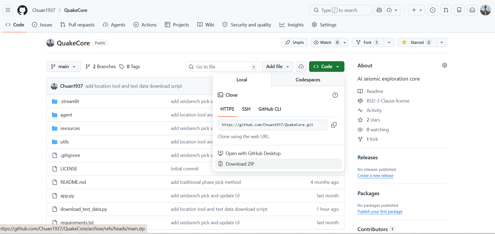
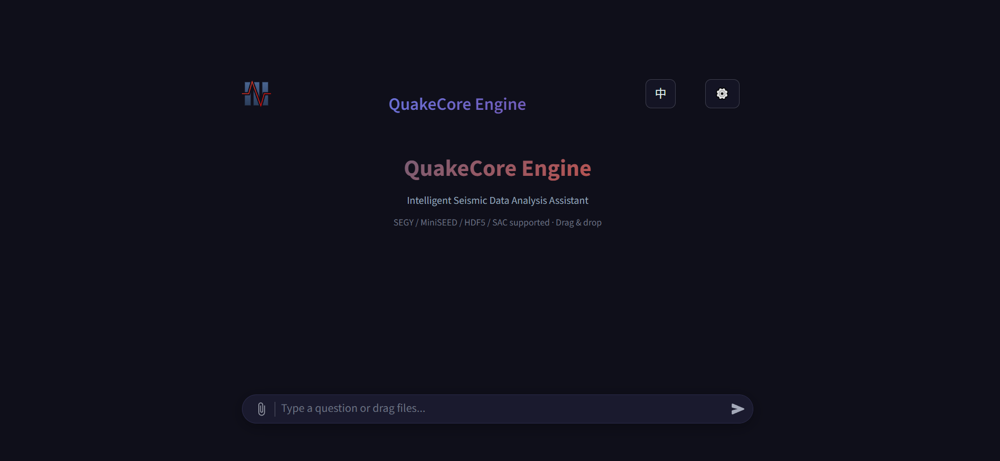
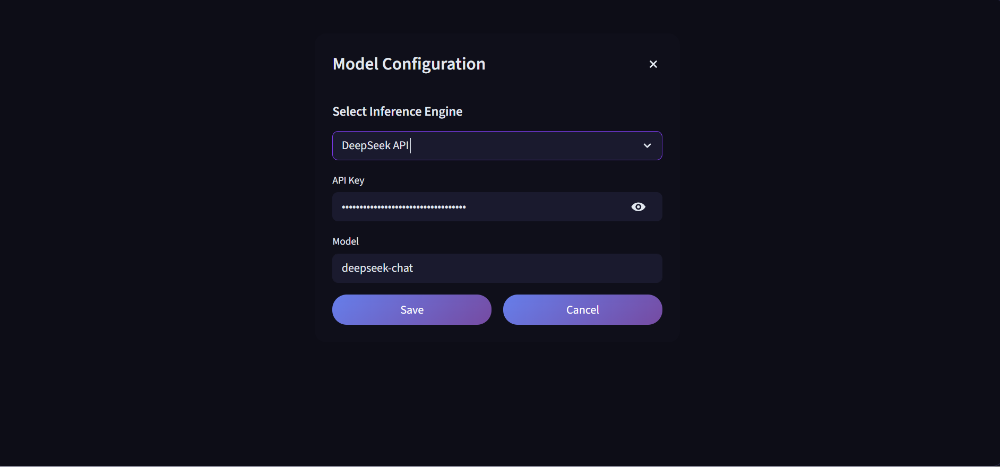
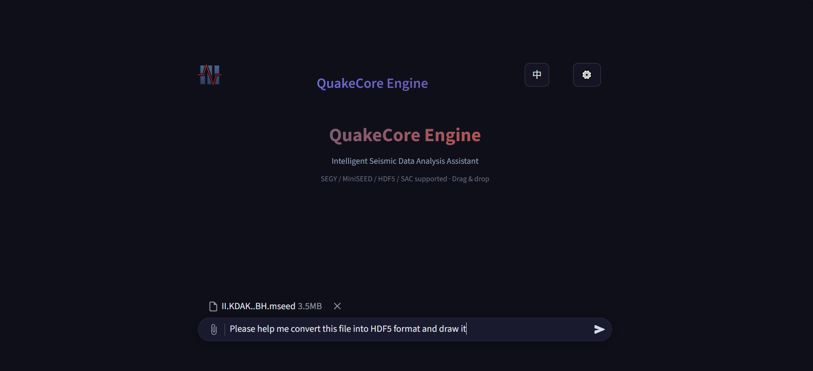
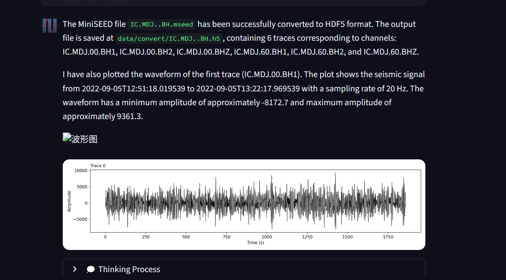
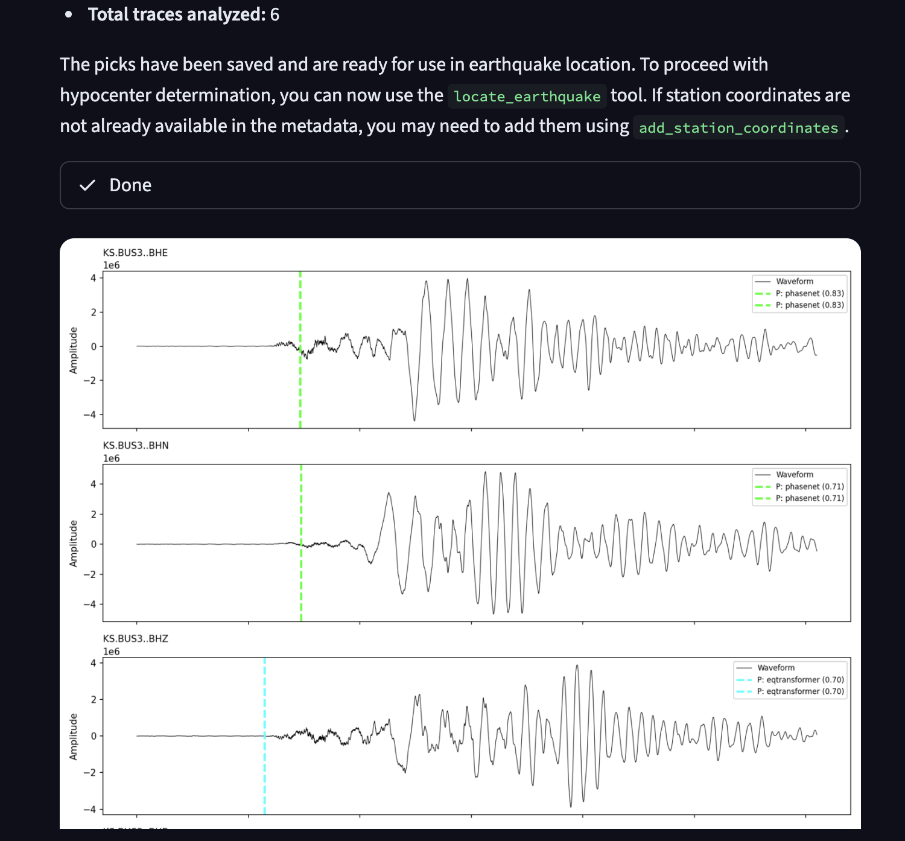
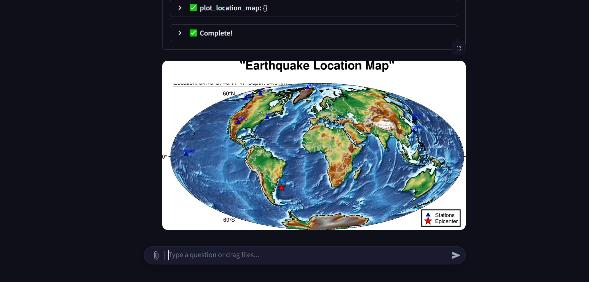

# QuakeCore Deployment Guide

This guide provides step-by-step instructions to download, set up, and run the QuakeCore application locally.

## Prerequisite
Ensure you have the following installed on your system:
- **[Git](https://git-scm.com/downloads)**
- **Conda** ([Miniconda](https://www.anaconda.com/docs/getting-started/miniconda/install/overview)) 

## 1. Download the Code

### Option A: Using Git (Recommended)
Clone the repository from GitHub and navigate into the project directory:
```bash
git clone https://github.com/Chuan1937/QuakeCore.git
cd QuakeCore
```

### Option B: Direct Download (ZIP)
If you do not have Git installed or the clone fails (e.g., `Connection was reset`), you can download the code directly:

1. Go to the repository page at [https://github.com/Chuan1937/QuakeCore](https://github.com/Chuan1937/QuakeCore).
2. Click the green **Code** button on the right-hand side and select **Download ZIP**.
3. Extract the downloaded `QuakeCore-main.zip` file.
4. Open your terminal (or command prompt):
   - **Windows**: Press `Win + R`, type `cmd`, and press Enter. 
   - **macOS / Linux**: Open the "Terminal" app.
5. Get into the extracted directory by using the `cd` (change directory) command. For example:
```bash
cd C:\Users\YourUsername\Downloads\QuakeCore-main
```

## 2. Environment Setup
We recommend using Conda to manage your Python environment. 
When you have the code downloaded, extracted and get into the directory, create and activate a new virtual environment:

```bash
# Create a new conda environment named 'quakecore' (Python 3.10 recommended)
conda create -n quakecore python=3.10 -y

# Activate the environment
conda activate quakecore

# Install the required dependencies
pip install -r requirements.txt
```

## 3. Usage & Running the App

QuakeCore is built with Streamlit,After you have set up the environment. To start the application, run the following command from the root of the project folder:

```bash
streamlit run app.py
```

Once the server starts, it will provide a local URL (typically `http://localhost:8501`) that you can open in your web browser to interact with the application.



## 4. LLM SETUP
QuakeCore relies on a language model (LLM) to generate responses. First, you need to click the gear button in the upper right corner of the page to configure the model.


You can choose to use Ollama or a remote API for the inference engine. If you choose Ollama, please ensure that you have installed Ollama and correctly configured the model. You can find detailed installation and configuration guides in the [official Ollama documentation](https://ollama.com/docs). If you choose a remote API, please ensure you have obtained the API key for the model.

Here, for demonstration purposes, we use DeepSeek. The API Key is `sk-7b50b44400f6467c82d3eb8234bc357c`, and the model is set to `deepseek-chat`. Then, save the configuration.

## 5. Example Usage

On the homepage, you can enter your questions or queries. After clicking submit, QuakeCore will use the configured LLM to generate a response. You can adjust the content and format of the questions as needed to obtain more accurate answers.

Currently, QuakeCore supports both Chinese and English. You can switch the language option in the settings to interact using different languages.

Features already implemented in QuakeCore include:

- download the seismic data using fsdn API.
- Conversion and plotting of different seismic data formats, including sac, mseed, csv, and hdf5
- Seismic direct wave first-arrival picking, including deep learning methods and traditional methods
- Earthquake location

### Data Download

You can use natural language to request data download, such as `Please download the seismic data for the Alaska region within a 500km radius from the current time`. QuakeCore will automatically fetch the relevant seismic data based on your request and save it in the local `data/fsdn` folder.


### Format Conversion

You can randomly select a file from the downloaded `example_data` folder and drag it into the input box. Then, you can use natural language, such as `Please help me convert this file to hdf5 format and plot it`, to perform format conversion and plotting.



After conversion is complete, the converted file will be saved by default in the local `data/convert` folder. The plotting result will also be output simultaneously.



### First-Arrival Picking

Similarly, you can drag a seismic data file ,sunch as `KS.BUS3..BH_Noto2024.mseed` into the input box and use natural language, such as `Please help me perform first-arrival picking on this file`, to start picking. Alternatively, you can directly use natural language during the previous step's process to perform first-arrival picking, such as `Please help me perform first-arrival picking on the previous file`.



### Earthquake Location

For earthquake location, you need to upload multiple seismic data files, with each file representing data from one station. You can drag multiple files into the input box and use natural language, such as `Please help me locate the earthquake using example_data  files`, to perform the earthquake location.




Note: QuakeCore is currently in the early stages of development, and we are continuously adding new features and improving existing ones. If you have any suggestions or encounter any issues while using the application, please feel free to reach out to us through the GitHub repository's issue tracker. Your feedback is invaluable in helping us enhance QuakeCore!